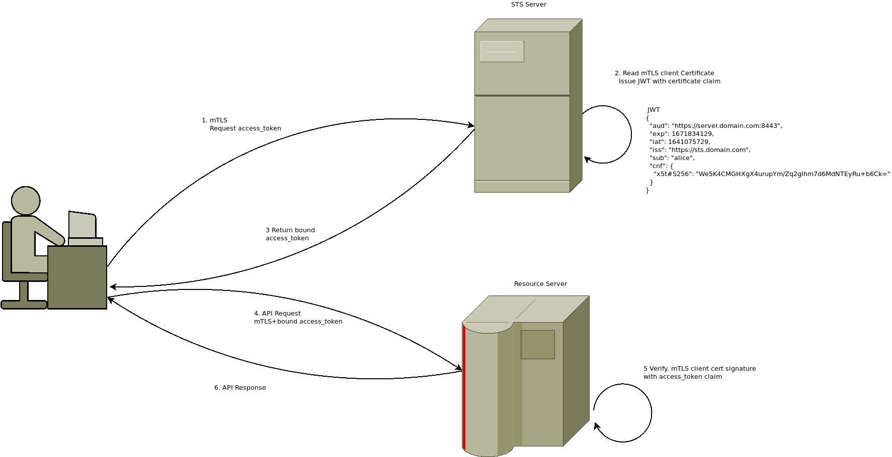

## Certificate Bound Tokens using Security Token Exchange Server (STS)

Sample demonstration of [Certificate Bound Tokens](https://tools.ietf.org/html/rfc8705) acquired from a [Security Token Exchange Server](https://datatracker.ietf.org/doc/html/rfc8693).

The basic idea behind bound tokens is that the signed bearer token (eg `JWT`) itself has information embedded within it which defines the transport/TLS client certificate that must be present for the token to be valid in.

For example , suppose you want to say "only trust this JWT if it is presented within an mTLS context that used a _specific_ client certificate.

Binding the token to the cert reduces the security risk of bearer tokens since nobody can reuse the bearer token without the client certificate

As an example, consider an application is in possession of a client certificate with the following hash:

```bash
$ openssl x509 -in certs/alice.crt -outform DER | openssl dgst -sha256 | cut -d" " -f2
59ee4ae023061d7817e2eaeea589bf66ada02219bb77a31d35313246ef9be829

$ echo "59ee4ae023061d7817e2eaeea589bf66ada02219bb77a31d35313246ef9be829" | xxd -r -p - | openssl enc -a 
We5K4CMGHXgX4urupYm/Zq2gIhm7d6MdNTEyRu+b6Ck=
```

If JWT token is issued with the following standard claim:


```json
{
  "alg": "RS256",
  "kid": "b9b8c3e23bb5d95c1520049e8824f9105cc207e",
  "typ": "JWT"
}
{
  "aud": "https://server.domain.com:8443",
  "exp": 1671834129,
  "iat": 1641075729,
  "iss": "https://sts.domain.com",
  "sub": "alice",
  "cnf": {
    "x5t#S256": "We5K4CMGHXgX4urupYm/Zq2gIhm7d6MdNTEyRu+b6Ck="
  }
}
```

then an application can only consider that token to be valid if the mTLS session context contains the hash of the client cert's public key as shown.  In other words, once mTLS is setup with the server, the TLS certificate is hashed and compared to the claims.  This way, even if the JWT token is stolen, it can't be used without the client cert.

---

### Background

`OAuth 2.0 Mutual-TLS Client Authentication and Certificate-Bound Access Tokens` [rfc 8705](https://tools.ietf.org/html/rfc8705) describes a mechanism where a specific specific claim in a JWT bearer token presented to a server includes the hash of the public certificate that is authorized and corresponds to the mTLS certificate currently used during the connection.

For example, if the public cert used by the client is `certs/alice.crt`, then the thumbprint is calculate as such and gets included into the JWT by the token issuer

```text
3.1.  JWT Certificate Thumbprint Confirmation Method

   When access tokens are represented as JSON Web Tokens (JWT)[RFC7519],
   the certificate hash information SHOULD be represented using the
   "x5t#S256" confirmation method member defined herein.

   To represent the hash of a certificate in a JWT, this specification
   defines the new JWT Confirmation Method [RFC7800] member "x5t#S256"
   for the X.509 Certificate SHA-256 Thumbprint.  The value of the
   "x5t#S256" member is a base64url-encoded [RFC4648] SHA-256 [SHS] hash
   (a.k.a. thumbprint, fingerprint or digest) of the DER encoding [X690]
   of the X.509 certificate [RFC5280].  The base64url-encoded value MUST
   omit all trailing pad '=' characters and MUST NOT include any line
   breaks, whitespace, or other additional characters.
```

Which eventually is sealed into a bearer token (JWT in this case) using the following claim:

```json
{
  "cnf": {
    "x5t#S256": "We5K4CMGHXgX4urupYm/Zq2gIhm7d6MdNTEyRu+b6Ck="
  }
}
```

For more information, see

* [Serverless Security Token Exchange Server(STS) and gRPC STS credentials](https://github.com/salrashid123/sts_server)
* [Envoy WASM and LUA filters for Certificate Bound Tokens](https://github.com/salrashid123/envoy_cert_bound_token)

---

This repo shows how to setup a sample STS server that checks the mtls connection and returns a bound JWT.  The resource REST server can verify the mtls session against the presented JWT:





### Setup

First override the hosts value as shown below.  This is done just for TLS SNI simplicity

`/etc/hosts`:

```
127.0.0.1  grpc.domain.com sts.domain.com server.domain.com
```

#### STS server

Run the STS server.  

The keyID is just an opaque hash of the sts.crt's public key and just use in the JWK (in reality, it can be any value since its just used to lookup the key in `jwk.json`

```bash
cd sts_server/
go run sts_server.go --port :8081 --tlsCA ../certs/tls-ca.crt \
  --tlsCert ../certs/sts.crt --tlsKey ../certs/sts.key \
  --jwtPrivateKey ../certs/jwt.key --jwtKeyID a97ff76fe140886420a9f4cd8fedeab1514a45e9
```

### curl

You can test the STS server by itself by using curl and mTLS:

```bash
# test as alice
$ curl -s -X POST -H "Content-Type: application/json" -d @curl/sts_req_alice.json  \
    -H "host: sts.domain.com"   --resolve  sts.domain.com:8081:127.0.0.1 \
    --cert certs/alice.crt    --key certs/alice.key  \
    --cacert certs/tls-ca.crt   https://sts.domain.com:8081/token | jq '.'

# test as bob
$ curl -s -X POST -H "Content-Type: application/json" -d @curl/sts_req_bob.json  \
    -H "host: sts.domain.com"   --resolve  sts.domain.com:8081:127.0.0.1 \
    --cert certs/bob.crt    --key certs/bob.key  \
    --cacert certs/tls-ca.crt   https://sts.domain.com:8081/token | jq '.'
```

The JWT returned has the certificate hash burned into it as shown in the claims above.

### REST

To test REST, first run the backend server

```bash
cd http/
go run src/server/server.go --port :8443 --tlsCA ../certs/tls-ca.crt  \
    --tlsCert ../certs/server.crt \
    --tlsKey ../certs/server.key --jwkFile ../certs/jwk.json
```

Then run the client

```
go run src/client/client.go --tlsCA ../certs/tls-ca.crt  \
    --tlsCert ../certs/alice.crt \
    --tlsKey ../certs/alice.key --stsaddress https://sts.domain.com:8081/token
```

What the client does on startup is contact the STS server over mTLS.

It then presents the initial token for the client

The STS server checks the mTLS client certificate, extracts its hash, and then if the initial token is valid, it will reissue a new JWT but one with the certificate hash burned into the claim.

From there, the client will emit that token to the resource server again over the mTLS using the same client certificate it used on the STS server  The resource will check the JWT, extract the claims that describes the client cert its bound to and then check the actual TLS context for the certificate presented.

If all goes well, the api call is allowed through.

If you want to test a failure, you can uncomment the code section in `client.go` which tries to use alice's bound token with bob's client certificate.  This second api call should fail since there is a mismatch

### gRPC

gRPC natively support `STS` credentials see [grpc.credentials.sts](https://pkg.go.dev/google.golang.org/grpc/credentials/sts).

I began to write a simple client server similar to REST that used STS and certificate bound tokens but ran into an issue:

When gRPC contacts an STS server on its own, it does NOT use client certificates and simply uses the generic http TLS system certs:

see [sts.go](https://github.com/grpc/grpc-go/blob/master/credentials/sts/sts.go#L195-L204)

This is problem since the STS server needs to know about the client cert for all this to work anyway. [Issue#5099](https://github.com/grpc/grpc-go/issues/5099)

For now, i've just left the code in as-is even though its not working

```bash
echo -n iamtheeggman > /tmp/cred.txt

go run src/grpc_server.go --grpcport :50051 \
   --tlsCert ../certs/grpc.crt \
   --tlsKey ../certs/grpc.key \
   --tlsCA ../certs/tls-ca.crt  \
   --jwkFile ../certs/jwk.json

go run src/grpc_client.go --host localhost:50051 \
   --servername grpc.domain.com --tlsCA ../certs/tls-ca.crt \
   --tlsCert ../certs/alice.crt --tlsKey ../certs/alice.key \
   --stsaddress https://sts.domain.com:8081/token --stsCred /tmp/cred.txt \
   --stsSNIServerName sts.domain.com
```

### Embedding private keys into Hardware

In the example above, the TLS certificates are plain PEM files on disk.  Users are free to embed the mTLS certificate into Hardware
like `Trusted Platform Module (TPM)` or `Yubikey` or other HSMs.  That way, at least the client certificate is more secure.


For additional information, see:

* [mTLS with TPM bound private key](https://github.com/salrashid123/go_tpm_https_embed)
* [golang-jwt library for Trusted Platform Module (TPM)](https://blog.salrashid.dev/articles/2021/go-jwt-tpm/)